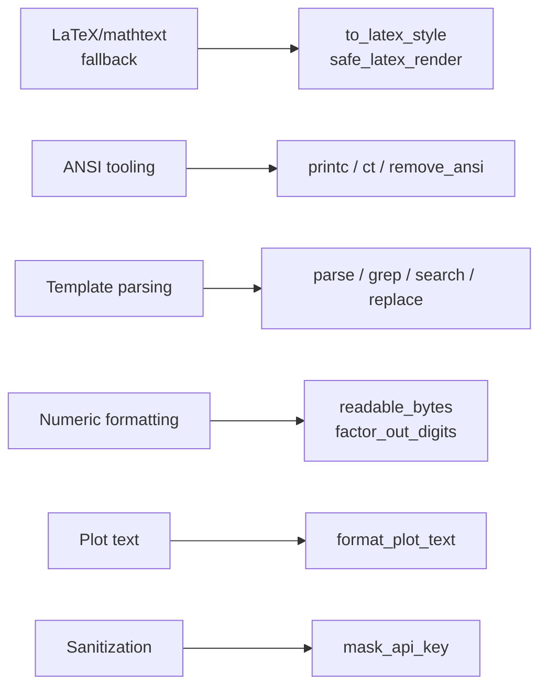
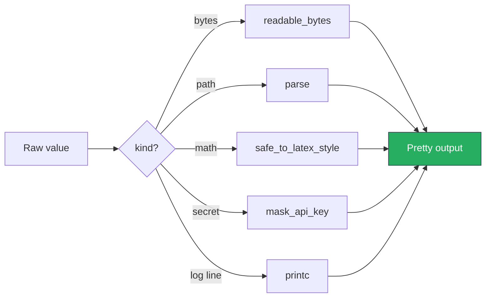

# SciTeX Str (`scitex-str`)

<p align="center">
  <a href="https://scitex.ai">
    
  </a>
</p>

<p align="center"><b>Text processing utilities for scientific workflows.</b></p>

<p align="center">
  <a href="https://scitex-str.readthedocs.io/">Full Documentation</a> · <code>uv pip install scitex-str[all]</code>
</p>

<!-- scitex-badges:start -->
<p align="center">
  <a href="https://pypi.org/project/scitex-str/"></a>
  <a href="https://pypi.org/project/scitex-str/"></a>
  <a href="https://github.com/ywatanabe1989/scitex-str/actions/workflows/test.yml"></a>
  <a href="https://github.com/ywatanabe1989/scitex-str/actions/workflows/install-test.yml"></a>
  <a href="https://codecov.io/gh/ywatanabe1989/scitex-str"></a>
  <a href="https://scitex-str.readthedocs.io/en/latest/"></a>
  <a href="https://www.gnu.org/licenses/agpl-3.0"></a>
</p>
<!-- scitex-badges:end -->

---

## Problem and Solution

| # | Problem | Solution |
|---|---------|----------|
| 1 | **LaTeX labels crash matplotlib when TeX isn't installed** — CI runners, laptops without MacTeX, Colab without `!apt install texlive` all fail | **`safe_latex_render(s)`** — auto-detects LaTeX; falls back to mathtext then unicode silently |
| 2 | **ANSI color codes + grep/parse sprinkled as ad-hoc `re` patterns** — each script reinvents the wheel | **Grab-bag of helpers** — `printc`, `color_text`, `grep`, `parse`, `replace`, `mask_api`, `readable_bytes` — boring but consistent across 33 packages |

## Installation

Requires Python >= 3.10.

```bash
pip install scitex-str
```

## Architecture

```
scitex_str/
├── _to_latex_style.py / _safe_to_latex_style.py   # LaTeX rendering with fallback
├── _color_text.py / _printc.py                     # ANSI color helpers
├── _parse.py / _grep.py / _search.py / _replace.py # text search & template parse
├── _format_plot_text.py                            # axis-label formatter
├── _readable_bytes.py / _factor_out_digits.py      # numeric formatting
├── _mask_api.py / _remove_ansi.py                  # sanitization
├── _squeeze_space.py / _title.py / _decapitalize.py# small string ops
└── ...                                              # ~20 boring helpers, one per file
```



<p align="center"><sub><b>Figure 1.</b> Module layout. Each helper is a single-file leaf — boring on purpose, consistent across 33 ecosystem packages.</sub></p>

## 1 Interfaces

<details open>
<summary><strong>Python API</strong></summary>

<br>

```python
import scitex_str as ss

# LaTeX-style formatting (with safe fallback)
ss.to_latex_style("theta")              # r"$\theta$"
ss.safe_to_latex_style("unknown")       # "unknown" (no error)

# Colored terminal output
ss.printc("Success!", color="green")
ss.ct("Warning", color="yellow")        # returns colored string

# Parse structured paths
ss.parse("./data/Patient_23/Hour_12",
         "./data/Patient_{id}/Hour_{hour}")  # {'id': 23, 'hour': 12}

# Plot text formatting
ss.format_plot_text("amplitude_mv")     # "Amplitude [mV]"

# Numeric formatting
ss.readable_bytes(1_500_000)            # "1.43 MB"
ss.factor_out_digits([1000, 2000, 3000])

# Misc
ss.grep(pattern, lines)
ss.search(...)
ss.replace(...)
ss.mask_api_key("sk-...")
ss.remove_ansi(text)
ss.squeeze_space("a  b   c")            # "a b c"
ss.title_case("hello world")
ss.decapitalize("Hello")
```

</details>

## Demo

```python
import scitex_str as ss

# 1) LaTeX-safe label rendering — no crash if TeX missing
label = ss.safe_to_latex_style("theta")    # "$\\theta$" or unicode fallback

# 2) Colored terminal status
ss.printc("[ok] tunnel established", color="green")
ss.printc("[warn] retry in 3s",      color="yellow")

# 3) Parse a structured directory
ss.parse("./data/Patient_23/Hour_12",
         "./data/Patient_{id}/Hour_{hour}")  # → {'id': 23, 'hour': 12}

# 4) Human-readable byte size
ss.readable_bytes(1_500_000)               # → "1.43 MB"

# 5) Mask credentials before logging
ss.mask_api_key("sk-abcdef1234567890")     # → "sk-***7890"
```



<p align="center"><sub><b>Figure 2.</b> Demo. Pick the helper by what you have, not by where it lives.</sub></p>

## Part of SciTeX

`scitex-str` is part of [**SciTeX**](https://scitex.ai). Install via
the umbrella with `pip install scitex[str]` to use as
`scitex.str` (Python) or `scitex str ...` (CLI).

>Four Freedoms for Research
>
>0. The freedom to **run** your research anywhere — your machine, your terms.
>1. The freedom to **study** how every step works — from raw data to final manuscript.
>2. The freedom to **redistribute** your workflows, not just your papers.
>3. The freedom to **modify** any module and share improvements with the community.
>
>AGPL-3.0 — because we believe research infrastructure deserves the same freedoms as the software it runs on.

## License

AGPL-3.0-only.

---

<p align="center">
  <a href="https://scitex.ai" target="_blank"></a>
</p>
